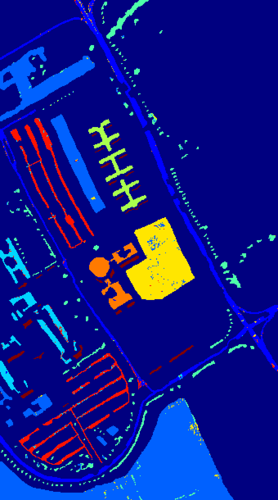

## HIS data Classification by 3DCNN classfier

Here, we illustriate PaviaU datasets and use 3DCNN for classification task.
For per category, we selected 200 samples randomly for training, and others for testing.

And the performance I may didn't find the best parameters, and here set the cube size as 3*3. 

### result

PaviaU



```
result
DataSet PaviaU shape is (610, 340, 103)
traindata-ID 1: 200; testdata-ID 1: 6431
traindata-ID 2: 200; testdata-ID 2: 18449
traindata-ID 3: 200; testdata-ID 3: 1899
traindata-ID 4: 200; testdata-ID 4: 2864
traindata-ID 5: 200; testdata-ID 5: 1145
traindata-ID 6: 200; testdata-ID 6: 4829
traindata-ID 7: 200; testdata-ID 7: 1130
traindata-ID 8: 200; testdata-ID 8: 3482
traindata-ID 9: 200; testdata-ID 9: 747
total train 1800, total test 40976
Tensor("Placeholder_1:0", shape=(?, 3, 3, 103), dtype=float32)
Tensor("classifer/conv00/Relu:0", shape=(?, 1, 3, 32, 64), dtype=float32)
Tensor("classifer/conv01/Relu:0", shape=(?, 1, 3, 30, 64), dtype=float32)
Tensor("classifer/conv02/Relu:0", shape=(?, 1, 3, 30, 64), dtype=float32)
Tensor("classifer/conv10/Relu:0", shape=(?, 1, 1, 14, 128), dtype=float32)
Tensor("classifer/conv11/Relu:0", shape=(?, 1, 1, 6, 128), dtype=float32)
Tensor("classifer/conv12/Relu:0", shape=(?, 1, 1, 6, 128), dtype=float32)
Tensor("classifer/conv20/Relu:0", shape=(?, 1, 1, 4, 256), dtype=float32)
Tensor("classifer/conv21/Relu:0", shape=(?, 1, 1, 1, 256), dtype=float32)
Tensor("classifer/conv22/Relu:0", shape=(?, 1, 1, 1, 256), dtype=float32)
Tensor("classifer/global_info/flatten/Reshape:0", shape=(?, 512), dtype=float32)
1 class: ( 6187 / 6431 ) 0.9620587777950552
2 class: ( 18146 / 18449 ) 0.9835763456013876
3 class: ( 1799 / 1899 ) 0.9473407056345445
4 class: ( 2743 / 2864 ) 0.9577513966480447
5 class: ( 1144 / 1145 ) 0.9991266375545852
6 class: ( 4647 / 4829 ) 0.9623110374818803
7 class: ( 1106 / 1130 ) 0.9787610619469026
8 class: ( 3281 / 3482 ) 0.9422745548535324
9 class: ( 747 / 747 ) 1.0
confusion matrix:
[[ 6187     2    11     2     1     8    24    47     0]
 [    0 18146     0   101     0   163     0     2     0]
 [   30     1  1799     0     0     1     0   144     0]
 [    0   144     0  2743     0     3     0     0     0]
 [    5     0     0     1  1144     0     0     1     0]
 [   37   152     0    17     0  4647     0     5     0]
 [   76     1     2     0     0     1  1106     2     0]
 [   96     3    87     0     0     6     0  3281     0]
 [    0     0     0     0     0     0     0     0   747]]
total right num: 39800
oa: 0.9713002733307302
aa: 0.9703556130573259
kappa: 0.9613927005933793
Groundtruth map get finished
test end!
decode map get finished
test end!
seg decode map get finished

```
