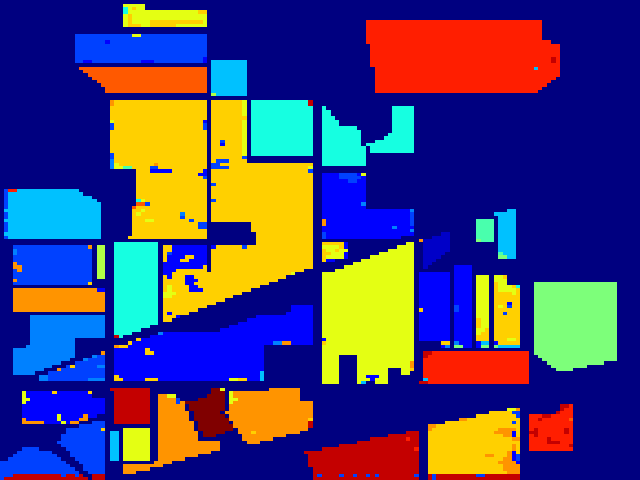
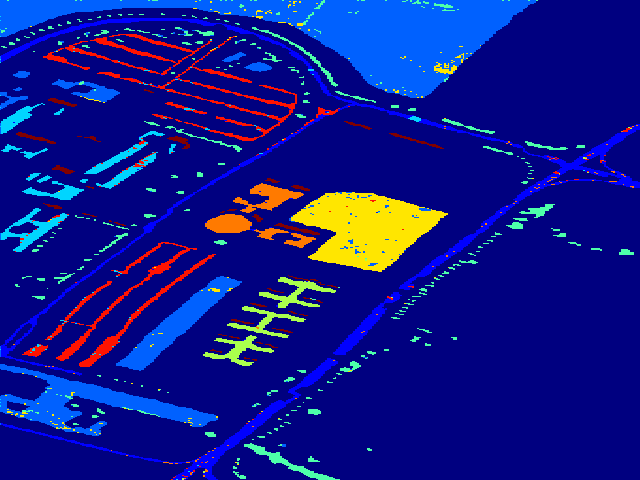
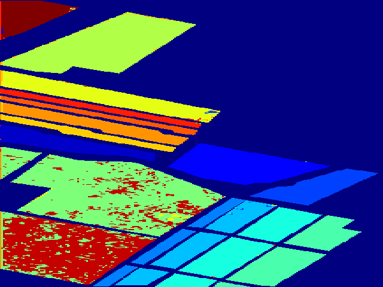

## HIS data Classification by knn(k近邻) classfier

Here, we illustriate some datasets and use svm for classification task.
For per category, we selected 200 samples(15 for the class number less than 200 in Indian_pines) randomly for training, and others for testing.

And the performance I may didn't find the best parameters, and here set the cube size as 5*5. 

### result
- Indian_pines
    - decode map
    

- PaviaU
    - decode map
    

- Salinas
    - decode map
    

training number 200 per class

|       | Indian Pines | PaviaU   | Salinas |
|:-----:|:------------:|:--------:|:-------:|
|OA     |   93.71      |  94.55   |  93.76  |
|AA     |   96.72      |  95.73   |  96.78  |
|Kappa  |   92.62      |  92.72   |  93.04  |

training number 200 per class

|       | Indian Pines | PaviaU   | Salinas |
|:-----:|:------------:|:--------:|:-------:|
|OA     |         |     |    |
|AA     |         |     |    |
|Kappa  |         |     |    |