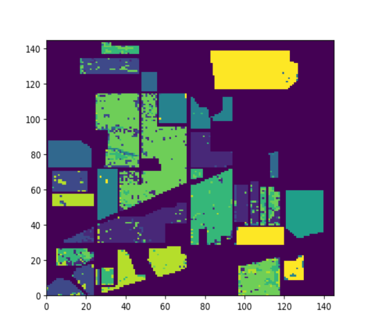
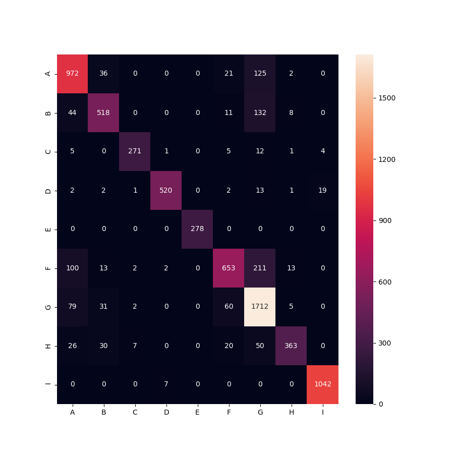
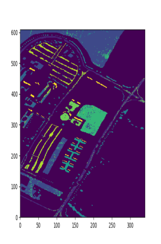
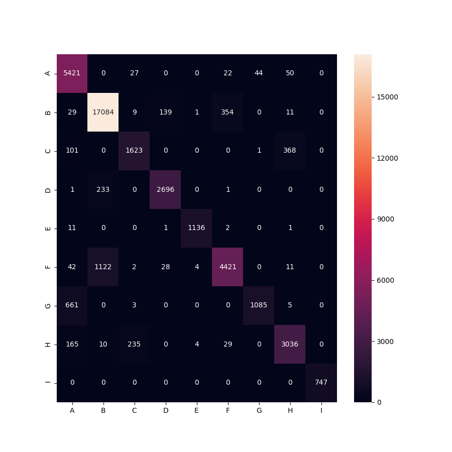
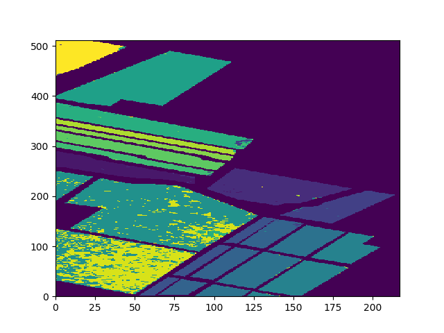
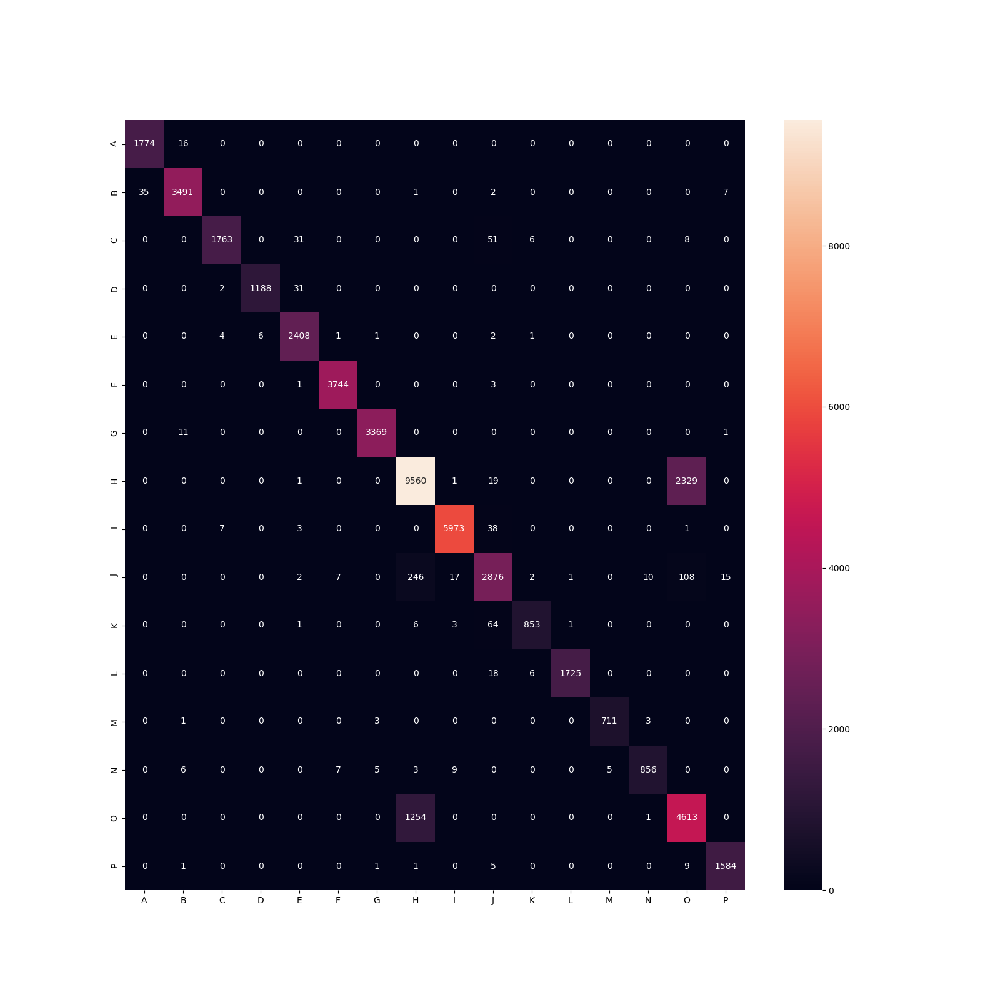

## HIS data Classification by svm classfier

Here, we illustriate some datasets and use svm for classification task.
For per category, we selected 200 samples randomly for training, and others for testing.

### result
- Indian_pines
    - overall accuracy 85.14%
    - kappa 82.37%
    - decode map
    
    
    
    
- PaviaU
    - overall accuracy 90.90%
    - kappa 87.90%
    - decode map
    
    
- Salinas 
- overall accuracy 91.28%
    - kappa 90.23%
    - decode map
    
    